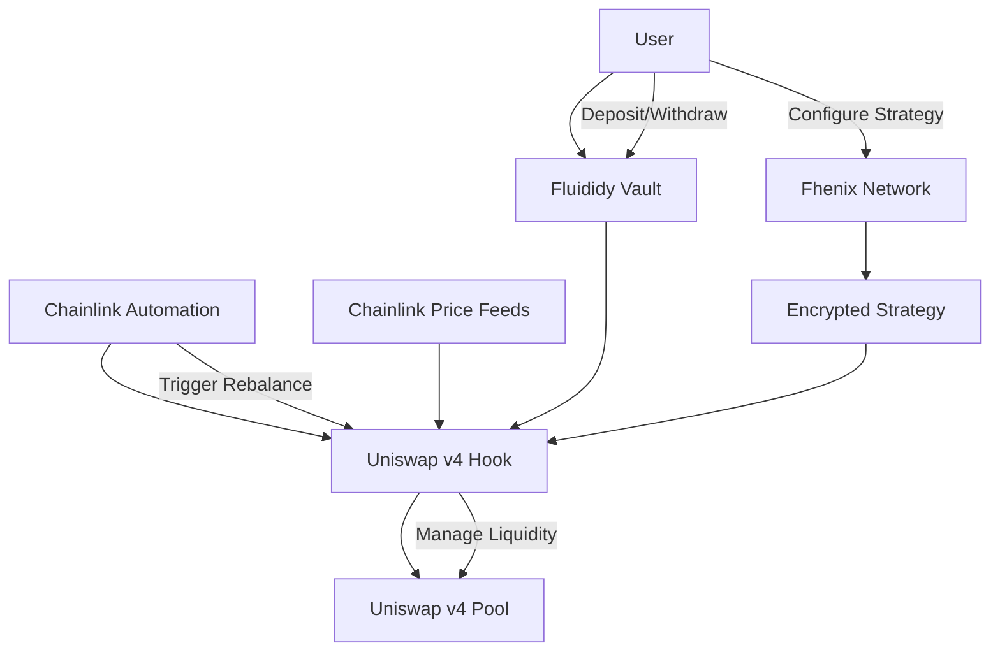

# Fluididy Design Document

## Overview

Fluididy is an automated liquidity management protocol built on Uniswap v4 that eliminates the active management burden for concentrated liquidity providers. The system combines three cutting-edge technologies:

- **Uniswap v4 Hooks**: Custom smart contract logic that integrates directly with pool operations
- **Chainlink Automation**: Decentralized keeper network for reliable, autonomous rebalancing triggers  
- **Fhenix FHE**: Fully Homomorphic Encryption for confidential strategy execution

The protocol operates as a vault system where users deposit token pairs, configure encrypted rebalancing strategies, and earn fees automatically without manual position management. The system protects users from MEV attacks and strategy copying through confidential computation while maintaining capital efficiency through intelligent rebalancing.

## Architecture

### High-Level System Flow



### Core Components

1. **FluidityVault**: Main user interface contract managing deposits, withdrawals, and LP tokens
2. **FluidityHook**: Uniswap v4 hook contract handling liquidity management and rebalancing logic
3. **StrategyManager**: Interface to Fhenix network for encrypted strategy storage and computation
4. **AutomationRegistry**: Chainlink Automation integration for autonomous rebalancing triggers
5. **PriceOracle**: Chainlink Price Feed integration for reliable price data

## Components and Interfaces

### FluidityVault Contract

**Purpose**: Primary user interface for deposits, withdrawals, and LP token management

**Key Functions**:
```solidity
interface IFluidityVault {
    function deposit(uint256 amount0, uint256 amount1, bytes calldata strategyParams) external returns (uint256 shares);
    function depositSingleSided(address token, uint256 amount, bytes calldata strategyParams) external returns (uint256 shares);
    function withdraw(uint256 shares) external returns (uint256 amount0, uint256 amount1);
    function partialWithdraw(uint256 sharePercentage) external returns (uint256 amount0, uint256 amount1);
    function emergencyWithdraw() external returns (uint256 amount0, uint256 amount1);
    function getPositionValue(address user) external view returns (uint256 totalValue, uint256 fees);
    function getPositionAnalytics(address user) external view returns (uint256 apy, int256 impermanentLoss, uint256 feesEarned);
    function compoundFees() external;
    function rebalanceTokenRatio() external; // Handle token imbalances
}
```

**State Variables**:
- `totalShares`: Total ERC20 LP tokens minted
- `userShares`: Mapping of user addresses to their share amounts
- `totalAssets0/totalAssets1`: Total vault assets for each token
- `hookContract`: Address of the associated Uniswap v4 hook
- `paused`: Emergency pause state

### FluidityHook Contract

**Purpose**: Uniswap v4 hook implementing automated liquidity management

**Key Functions**:
```solidity
interface IFluidityHook {
    function rebalance(uint256 positionId) external onlyAuthorized;
    function checkRebalanceCondition(uint256 positionId) external view returns (bool needsRebalance);
    function addLiquidity(int24 tickLower, int24 tickUpper, uint256 amount0, uint256 amount1) external;
    function removeLiquidity(uint256 tokenId) external;
    function calculateOptimalRange(uint256 currentPrice, uint256 rangeWidth) external view returns (int24 tickLower, int24 tickUpper);
    function swapToOptimalRatio(uint256 amount0, uint256 amount1, uint256 targetPrice) external returns (uint256 newAmount0, uint256 newAmount1);
}
```

**Hook Integration Points**:
- `beforeSwap()`: Optional price monitoring for gas-efficient rebalancing detection
- `afterSwap()`: Post-swap liquidity range validation
- Access to pool state for efficient liquidity management

### StrategyManager (Fhenix Integration)

**Purpose**: Interface for encrypted strategy storage and confidential computation

**Key Functions**:
```solidity
interface IStrategyManager {
    function setEncryptedStrategy(address user, bytes calldata encryptedParams) external;
    function getRebalanceThreshold(address user) external view returns (uint256 threshold);
    function getRangeWidth(address user) external view returns (uint256 width);
    function getMinRebalanceInterval(address user) external view returns (uint256 interval);
    function computeRebalanceDecision(address user, uint256 currentPrice) external view returns (bool shouldRebalance);
    function isHealthy() external view returns (bool);
    function enableFallbackMode(address user, bool usePublicStrategy) external;
}
```

**Fhenix Integration**:
- Encrypted storage of user strategy parameters
- Confidential computation of rebalancing conditions
- Zero-knowledge proof generation for strategy validation
- Secure key management for user access control

**Fallback Strategy for Fhenix Downtime**:
- **Health Monitoring**: Continuous monitoring of Fhenix network availability
- **User Choice**: Users can opt-in to public strategy execution during downtime
- **Default Behavior**: System pauses new rebalancing for privacy-first users
- **Safe Defaults**: Conservative public parameters (5% threshold, 10% range) for opted-in users
- **Automatic Recovery**: Resume encrypted operations when Fhenix network recovers

### AutomationRegistry (Chainlink Integration)

**Purpose**: Chainlink Automation integration for autonomous rebalancing

**Key Functions**:
```solidity
interface IAutomationRegistry {
    function checkUpkeep(bytes calldata checkData) external view returns (bool upkeepNeeded, bytes memory performData);
    function performUpkeep(bytes calldata performData) external;
    function registerPosition(uint256 positionId, address user) external;
    function updateGasThreshold(uint256 newThreshold) external onlyOwner;
}
```

**Automation Logic**:
- Periodic checking of all registered positions
- Gas cost validation before rebalancing execution
- Economic viability assessment (fees earned vs gas costs)
- Fallback mechanisms for automation failures

## Optimal Range Calculation Algorithms

### Baseline Algorithm: Symmetric Range Around Current Price

The default range calculation uses a symmetric approach centered on the current price:

```solidity
function calculateSymmetricRange(uint256 currentPrice, uint256 rangeWidthBps) 
    internal pure returns (int24 tickLower, int24 tickUpper) {
    
    // Convert price to tick (log base 1.0001)
    int24 currentTick = TickMath.getTickAtSqrtRatio(uint160(sqrt(currentPrice)));
    
    // Calculate tick range based on width in basis points
    int24 tickRange = int24((rangeWidthBps * 2302) / 10000); // 2302 ≈ ln(1.01) * 10000
    
    tickLower = currentTick - tickRange / 2;
    tickUpper = currentTick + tickRange / 2;
    
    // Ensure ticks are properly spaced for the pool
    tickLower = (tickLower / tickSpacing) * tickSpacing;
    tickUpper = (tickUpper / tickSpacing) * tickSpacing;
}
```

### Advanced Algorithms (Future Implementation)

- **Volatility-Adjusted Range**: Wider ranges during high volatility periods
- **Mean Reversion Strategy**: Asymmetric ranges based on price momentum
- **Volume-Weighted Range**: Adjust range based on trading volume patterns

### Single-Sided Deposit Handling

```solidity
function handleSingleSidedDeposit(address token, uint256 amount, uint256 targetPrice) 
    internal returns (uint256 amount0, uint256 amount1) {
    
    if (token == token0) {
        // Swap half to token1 to achieve optimal ratio
        uint256 swapAmount = calculateOptimalSwapAmount(amount, targetPrice);
        amount1 = swapExactInputSingle(token0, token1, swapAmount);
        amount0 = amount - swapAmount;
    } else {
        // Similar logic for token1 deposits
        uint256 swapAmount = calculateOptimalSwapAmount(amount, targetPrice);
        amount0 = swapExactInputSingle(token1, token0, swapAmount);
        amount1 = amount - swapAmount;
    }
}
```

## Data Models

### Position Structure
```solidity
struct Position {
    address owner;
    uint256 tokenId;        // Uniswap v4 position NFT ID
    int24 tickLower;        // Current range lower bound
    int24 tickUpper;        // Current range upper bound
    uint256 liquidity;      // Current liquidity amount
    uint256 lastRebalance;  // Timestamp of last rebalancing
    bytes32 strategyHash;   // Hash of encrypted strategy parameters
    bool active;            // Position status
}
```

### Strategy Parameters (Encrypted)
```solidity
struct StrategyParams {
    uint256 rebalanceThreshold;    // Price movement % to trigger rebalance
    uint256 rangeWidth;           // Liquidity range width %
    uint256 minInterval;          // Minimum time between rebalances
    uint256 maxSlippage;          // Maximum acceptable slippage %
    bool autoCompound;            // Automatic fee compounding flag
}
```

### Rebalancing Event
```solidity
struct RebalanceEvent {
    uint256 positionId;
    uint256 timestamp;
    int24 oldTickLower;
    int24 oldTickUpper;
    int24 newTickLower;
    int24 newTickUpper;
    uint256 gasUsed;
    uint256 feesCollected;
    uint256 priceAtRebalance;
    uint256 liquidityBefore;
    uint256 liquidityAfter;
}
```

### Analytics Data Structure
```solidity
struct PositionAnalytics {
    uint256 totalFeesEarned;      // Cumulative fees collected
    uint256 totalGasPaid;         // Cumulative gas costs
    uint256 initialValue;         // Position value at deposit
    uint256 currentValue;         // Current position value
    uint256 holdValue;            // Value if tokens were held without LP
    uint256 lastUpdateTimestamp;  // Last analytics calculation
    uint256 totalRebalances;      // Number of rebalancing events
    int256 impermanentLoss;       // Current IL in basis points
    uint256 annualizedReturn;     // APY in basis points
}
```

### Event Definitions for Analytics
```solidity
event Deposit(address indexed user, uint256 amount0, uint256 amount1, uint256 shares, uint256 timestamp);
event Withdrawal(address indexed user, uint256 shares, uint256 amount0, uint256 amount1, uint256 timestamp);
event Rebalance(uint256 indexed positionId, int24 newTickLower, int24 newTickUpper, uint256 feesCollected, uint256 timestamp);
event FeesCompounded(uint256 indexed positionId, uint256 amount0, uint256 amount1, uint256 timestamp);
event AnalyticsUpdate(address indexed user, uint256 apy, int256 impermanentLoss, uint256 totalFees, uint256 timestamp);
```

## Error Handling

### Rebalancing Failures
- **Slippage Protection**: Revert if price impact exceeds user-defined limits
- **Gas Cost Validation**: Skip rebalancing if gas costs exceed potential fee earnings
- **Liquidity Constraints**: Handle insufficient pool liquidity gracefully
- **Price Oracle Failures**: Use backup price sources or pause operations

### Automation Failures
- **Keeper Network Issues**: Implement manual override functions for emergency rebalancing
- **Gas Price Spikes**: Dynamic gas threshold adjustment based on network conditions
- **Network Congestion**: Queue rebalancing operations with priority scoring

### Fhenix Integration Failures
- **Encryption Errors**: Fallback to default strategy parameters with user notification
- **Key Management Issues**: Secure key recovery mechanisms
- **Computation Failures**: Graceful degradation to public computation with user consent

### Emergency Scenarios
- **Contract Pause**: Allow user withdrawals while preventing new deposits
- **Hook Malfunction**: Emergency liquidity extraction directly from Uniswap pools
- **Oracle Manipulation**: Circuit breakers for abnormal price movements

## Testing Strategy

### Unit Testing
- **Vault Operations**: Deposit, withdrawal, and LP token mechanics
- **Hook Functions**: Liquidity management and rebalancing logic
- **Strategy Encryption**: Fhenix integration and confidential computation
- **Automation Logic**: Chainlink keeper condition checking and execution

### Integration Testing
- **End-to-End Flows**: Complete user journey from deposit to automated rebalancing
- **Cross-Contract Interactions**: Vault-Hook-Uniswap integration testing
- **External Dependencies**: Chainlink and Fhenix network integration
- **Failure Scenarios**: Error handling and recovery mechanisms

### Performance Testing
- **Gas Optimization**: Benchmark rebalancing costs against competitors
- **Scalability**: Test with multiple concurrent positions and high transaction volumes
- **Latency**: Measure automation response times under various network conditions

### Security Testing
- **Smart Contract Audits**: Comprehensive security review by reputable firms
- **MEV Resistance**: Validate confidential strategy protection
- **Access Control**: Test authorization mechanisms and privilege escalation
- **Economic Attacks**: Simulate various attack vectors and economic exploits

### Testnet Deployment
- **Goerli/Sepolia**: Initial testing with mock Chainlink and Fhenix services
- **Mainnet Fork**: Production-like testing with real price feeds and automation
- **Stress Testing**: High-load scenarios with multiple users and positions

## Implementation Phases

### Phase 1: Core Infrastructure
- Deploy basic vault and hook contracts
- Implement fundamental deposit/withdrawal mechanics
- Basic liquidity management without automation

### Phase 2: Automation Integration
- Integrate Chainlink Automation and Price Feeds
- Implement automated rebalancing logic
- Add economic viability checks

### Phase 3: Privacy Layer
- Integrate Fhenix for encrypted strategy storage
- Implement confidential computation for rebalancing decisions
- Add secure key management

### Phase 4: Production Hardening
- Comprehensive security audits
- Gas optimization and performance tuning
- Emergency mechanisms and governance integration

This design provides a robust foundation for building Fluididy as a production-ready automated liquidity management protocol that addresses all the requirements while maintaining security, efficiency, and user privacy.