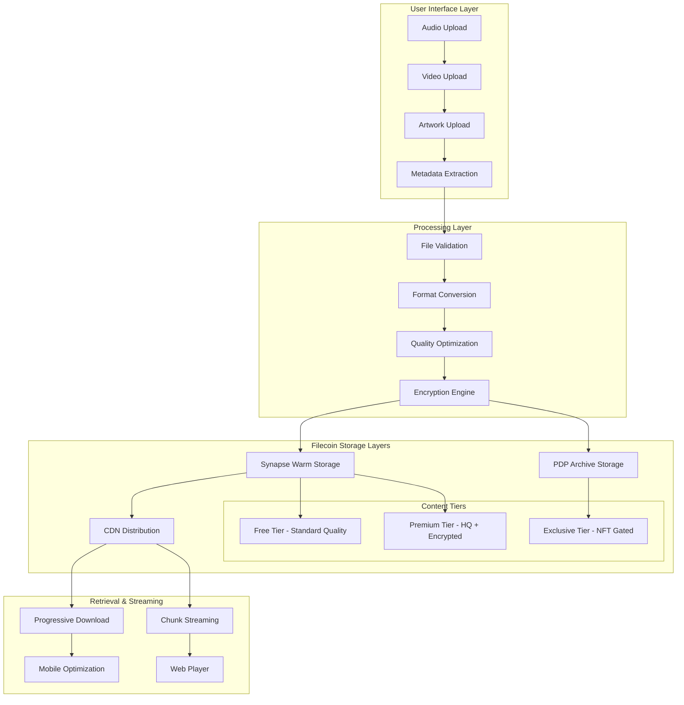

# 🗄️ Filecoin Storage Architecture for StreamVault V2
## Optimized for Streaming Media & Creator Economy

### 🏗️ **Storage Layer Architecture**



---

## 📁 **File Organization Strategy**

### **1. Content Type Structure**

```typescript
interface MediaFileStructure {
  // Audio content (primary platform focus)
  audio: {
    originalFormat: string;    // .wav, .flac (lossless)
    streamingFormats: {
      high: string;            // 320kbps MP3/AAC
      standard: string;        // 192kbps MP3
      preview: string;         // 30s @ 128kbps
    };
    metadata: AudioMetadata;
  };

  // Visual content
  visual: {
    artwork: string;           // Album covers, profile pics
    videos: string[];          // Music videos, behind-scenes
    thumbnails: string[];      // Generated previews
  };

  // Exclusive content
  premium: {
    encryptedAudio: string;    // Full HQ version
    exclusiveContent: string;  // Bonus tracks, stems
    nftAssets: string[];       // Limited edition content
  };
}
```

### **2. Storage Tier Implementation**

```typescript
// services/tieredStorage.ts
class TieredStorageService {
  async uploadTrack(
    audioFile: File,
    creator: Creator,
    accessLevel: 'free' | 'premium' | 'exclusive'
  ): Promise<StorageResult> {

    const results: StorageResult = {
      pieceCids: {},
      streamingUrls: {},
      encryptionKeys: {}
    };

    // 1. Process and optimize audio
    const processedAudio = await this.processAudioFile(audioFile);

    // 2. Create quality variants
    const audioVariants = await this.createQualityVariants(processedAudio);

    // 3. Upload to appropriate storage tier
    switch (accessLevel) {
      case 'free':
        results.pieceCids.standard = await this.uploadToWarmStorage(
          audioVariants.standard
        );
        results.pieceCids.preview = await this.uploadToWarmStorage(
          audioVariants.preview
        );
        break;

      case 'premium':
        // Encrypt high-quality version
        const { encrypted, key } = await this.encryptContent(audioVariants.high);
        results.pieceCids.encrypted = await this.uploadToWarmStorage(encrypted);
        results.encryptionKeys.premium = key;

        // Standard version remains unencrypted
        results.pieceCids.standard = await this.uploadToWarmStorage(
          audioVariants.standard
        );
        break;

      case 'exclusive':
        // Full track encrypted + PDP archival
        const { encrypted: exclusiveEncrypted, key: exclusiveKey } =
          await this.encryptContent(audioVariants.original);

        results.pieceCids.exclusive = await this.uploadToPDP(
          exclusiveEncrypted,
          { permanentStorage: true, redundancy: 3 }
        );
        results.encryptionKeys.exclusive = exclusiveKey;
        break;
    }

    // 4. Enable CDN for all variants
    results.streamingUrls = await this.enableCDN(results.pieceCids);

    return results;
  }

  private async processAudioFile(file: File): Promise<ProcessedAudio> {
    // Extract metadata using ID3 parsing
    const metadata = await this.extractMetadata(file);

    // Validate audio quality and format
    if (!this.isValidAudioFile(file, metadata)) {
      throw new Error('Invalid audio file format');
    }

    return {
      buffer: await file.arrayBuffer(),
      metadata,
      duration: metadata.duration,
      bitrate: metadata.bitrate
    };
  }

  private async createQualityVariants(audio: ProcessedAudio): Promise<QualityVariants> {
    return {
      original: audio.buffer,                    // Lossless preservation
      high: await this.transcode(audio, 320),    // 320kbps for premium
      standard: await this.transcode(audio, 192), // 192kbps for free tier
      preview: await this.createPreview(audio, 30) // 30-second preview
    };
  }

  private async uploadToWarmStorage(data: ArrayBuffer): Promise<string> {
    const uint8Data = new Uint8Array(data);
    const result = await synapse.storage.upload(uint8Data, {
      withCDN: true,
      permanentStorage: false // Warm storage for active content
    });

    return result.pieceCid;
  }

  private async uploadToPDP(data: ArrayBuffer, options: PDPOptions): Promise<string> {
    const uint8Data = new Uint8Array(data);
    const result = await synapse.storage.upload(uint8Data, {
      withCDN: false,
      permanentStorage: true,
      redundancy: options.redundancy
    });

    return result.pieceCid;
  }
}
```

---

## 🔐 **Encryption & Access Control**

### **1. Content Encryption Strategy**

```typescript
// services/contentEncryption.ts
class ContentEncryptionService {
  // AES-256 encryption for premium content
  async encryptPremiumContent(
    audioBuffer: ArrayBuffer,
    creatorId: string,
    contentId: string
  ): Promise<EncryptionResult> {

    // Generate content-specific key
    const encryptionKey = await this.generateContentKey(creatorId, contentId);

    // Encrypt audio data
    const encryptedBuffer = await crypto.subtle.encrypt(
      {
        name: 'AES-GCM',
        iv: crypto.getRandomValues(new Uint8Array(12))
      },
      encryptionKey,
      audioBuffer
    );

    // Store encryption metadata
    const keyMetadata = {
      algorithm: 'AES-GCM',
      keyDerivation: 'PBKDF2',
      accessRequirement: 'creator_coin_holding', // or 'nft_ownership'
      createdAt: Date.now()
    };

    return {
      encryptedData: new Uint8Array(encryptedBuffer),
      keyHash: await this.hashKey(encryptionKey),
      metadata: keyMetadata
    };
  }

  // Key-based decryption for verified users
  async decryptForAuthorizedUser(
    encryptedPieceCid: string,
    userWallet: string,
    creatorId: string
  ): Promise<ArrayBuffer> {

    // Verify user has access rights
    const hasAccess = await this.verifyUserAccess(userWallet, creatorId);
    if (!hasAccess) {
      throw new Error('Access denied: insufficient creator coin holdings');
    }

    // Retrieve encrypted content
    const encryptedData = await synapse.storage.download(encryptedPieceCid);

    // Reconstruct decryption key
    const decryptionKey = await this.reconstructKey(creatorId, userWallet);

    // Decrypt content
    return await crypto.subtle.decrypt(
      { name: 'AES-GCM', iv: encryptedData.slice(0, 12) },
      decryptionKey,
      encryptedData.slice(12)
    );
  }

  private async verifyUserAccess(
    userWallet: string,
    creatorId: string
  ): Promise<boolean> {
    // Check creator coin holdings
    const coinBalance = await this.getCreatorCoinBalance(userWallet, creatorId);
    const minHolding = await this.getMinimumHolding(creatorId);

    if (coinBalance >= minHolding) return true;

    // Check NFT ownership for exclusive content
    const nftOwned = await this.checkNFTOwnership(userWallet, creatorId);
    if (nftOwned) return true;

    // Check premium subscription
    const hasSubscription = await this.checkPremiumSubscription(userWallet);
    return hasSubscription;
  }
}
```

### **2. Smart Contract Access Control**

```solidity
// contracts/ContentAccess.sol
pragma solidity ^0.8.19;

contract ContentAccessControl {
    struct ContentAccess {
        string encryptedPieceCid;
        address creator;
        uint256 minCoinHolding;    // Min creator coins required
        uint256 minNFTHolding;     // Min NFTs required
        bool isPremiumRequired;     // Requires subscription
        uint256 accessPrice;        // One-time access fee
    }

    mapping(string => ContentAccess) public contentAccess;
    mapping(address => mapping(string => uint256)) public userAccessExpiry;

    event AccessGranted(
        address indexed user,
        string contentId,
        uint256 expiryTime
    );

    function requestAccess(string calldata contentId)
        external
        payable
        returns (bool granted)
    {
        ContentAccess memory content = contentAccess[contentId];

        // Check creator coin holdings
        uint256 coinBalance = IERC20(content.creator).balanceOf(msg.sender);
        if (coinBalance >= content.minCoinHolding) {
            granted = true;
        }

        // Check NFT ownership
        else if (content.minNFTHolding > 0) {
            uint256 nftBalance = IERC721(getNFTContract(content.creator)).balanceOf(msg.sender);
            if (nftBalance >= content.minNFTHolding) {
                granted = true;
            }
        }

        // Check payment for temporary access
        else if (msg.value >= content.accessPrice) {
            granted = true;
            userAccessExpiry[msg.sender][contentId] = block.timestamp + 30 days;
        }

        require(granted, "Access denied");

        emit AccessGranted(msg.sender, contentId, userAccessExpiry[msg.sender][contentId]);
        return granted;
    }

    function hasValidAccess(address user, string calldata contentId)
        external
        view
        returns (bool)
    {
        ContentAccess memory content = contentAccess[contentId];

        // Permanent access via coin holdings
        uint256 coinBalance = IERC20(content.creator).balanceOf(user);
        if (coinBalance >= content.minCoinHolding) return true;

        // Temporary paid access
        return userAccessExpiry[user][contentId] > block.timestamp;
    }
}
```

---

## 📡 **Streaming Optimization**

### **1. Progressive Download Strategy**

```typescript
// services/streamingOptimization.ts
class StreamingOptimizationService {
  async getOptimizedStreamingUrl(
    pieceCid: string,
    userDevice: DeviceType,
    connectionSpeed: ConnectionSpeed
  ): Promise<StreamingOptions> {

    const baseUrl = await synapse.storage.download(pieceCid, { withCDN: true });

    return {
      // Adaptive bitrate streaming
      adaptiveSources: {
        high: userDevice === 'desktop' ? baseUrl.high : null,
        standard: baseUrl.standard,
        low: connectionSpeed === 'slow' ? baseUrl.low : null
      },

      // Progressive download chunks
      progressiveChunks: await this.createProgressiveChunks(pieceCid),

      // Preload optimization
      preloadStrategy: this.getPreloadStrategy(userDevice, connectionSpeed),

      // Cache headers
      cacheControl: 'public, max-age=86400', // 24 hour cache
    };
  }

  private async createProgressiveChunks(pieceCid: string): Promise<StreamChunk[]> {
    // Break audio into 10-second chunks for progressive loading
    const audioData = await synapse.storage.download(pieceCid);
    const chunkSize = this.calculateChunkSize(audioData);

    const chunks: StreamChunk[] = [];
    for (let i = 0; i < audioData.length; i += chunkSize) {
      chunks.push({
        index: chunks.length,
        startTime: (chunks.length * 10), // 10 seconds per chunk
        chunkData: audioData.slice(i, i + chunkSize),
        pieceCid: await this.uploadChunk(audioData.slice(i, i + chunkSize))
      });
    }

    return chunks;
  }

  private getPreloadStrategy(
    device: DeviceType,
    speed: ConnectionSpeed
  ): PreloadStrategy {
    if (device === 'mobile' && speed === 'slow') {
      return 'preview-only'; // Load only 30s preview
    }

    if (device === 'mobile') {
      return 'first-minute'; // Load first 60 seconds
    }

    return 'full-track'; // Desktop gets full preload
  }
}
```

### **2. CDN Integration Enhanced**

```typescript
// services/cdnOptimization.ts
class CDNOptimizationService {
  async optimizeForGlobalDelivery(pieceCid: string): Promise<CDNConfiguration> {

    // Configure CDN rules for different content types
    const cdnConfig: CDNConfiguration = {
      // Audio files - long cache, edge optimization
      audioFiles: {
        cacheRules: {
          ttl: 86400 * 7, // 7 days
          staleWhileRevalidate: 86400, // 1 day
        },
        edgeRules: {
          compression: 'gzip',
          minify: false, // Don't minify audio
          adaptiveDelivery: true,
        },
        geoRules: {
          originShield: true,
          regionalEdges: ['us-east', 'eu-west', 'asia-pacific'],
        }
      },

      // Image assets - aggressive caching
      imageFiles: {
        cacheRules: {
          ttl: 86400 * 30, // 30 days
          staleWhileRevalidate: 86400 * 7,
        },
        edgeRules: {
          imageOptimization: true,
          webpConversion: true,
          responsiveImages: true,
        }
      },

      // Preview clips - medium cache
      previewFiles: {
        cacheRules: {
          ttl: 86400 * 3, // 3 days
          staleWhileRevalidate: 86400,
        }
      }
    };

    // Apply configuration to Synapse CDN
    await this.applyCDNConfig(pieceCid, cdnConfig);

    return cdnConfig;
  }

  async getGlobalDeliveryUrls(pieceCid: string): Promise<GlobalDeliveryUrls> {
    return {
      global: `https://cdn.synapse.io/piece/${pieceCid}`,
      regional: {
        'us-east': `https://us-east.cdn.synapse.io/piece/${pieceCid}`,
        'eu-west': `https://eu-west.cdn.synapse.io/piece/${pieceCid}`,
        'asia-pacific': `https://asia.cdn.synapse.io/piece/${pieceCid}`,
      },
      adaptive: `https://adaptive.cdn.synapse.io/piece/${pieceCid}/manifest.m3u8`
    };
  }
}
```

---

## 📊 **Storage Cost Optimization**

### **1. Intelligent Storage Placement**

```typescript
// services/storageCostOptimizer.ts
class StorageCostOptimizer {
  async optimizeStoragePlacement(
    content: MediaContent,
    creator: Creator
  ): Promise<StoragePlacement> {

    const analytics = await this.getContentAnalytics(content.id);

    // Determine optimal storage tier based on usage patterns
    if (analytics.playsLastMonth > 1000) {
      // High-traffic content → Warm Storage + CDN
      return {
        primaryStorage: 'warm-storage',
        cdnEnabled: true,
        archivalStorage: false,
        estimatedMonthlyCost: this.calculateWarmStorageCost(content.size)
      };
    }

    else if (analytics.playsLastMonth > 100) {
      // Medium traffic → Warm Storage only
      return {
        primaryStorage: 'warm-storage',
        cdnEnabled: false,
        archivalStorage: false,
        estimatedMonthlyCost: this.calculateWarmStorageCost(content.size) * 0.7
      };
    }

    else if (content.accessLevel === 'exclusive') {
      // Low traffic exclusive → PDP Archive
      return {
        primaryStorage: 'pdp-archive',
        cdnEnabled: false,
        archivalStorage: true,
        estimatedMonthlyCost: this.calculatePDPCost(content.size)
      };
    }

    else {
      // Very low traffic → Cold storage with migration plan
      return {
        primaryStorage: 'cold-storage',
        cdnEnabled: false,
        archivalStorage: true,
        migrationPlan: 'promote-if-traffic-increases',
        estimatedMonthlyCost: this.calculateColdStorageCost(content.size)
      };
    }
  }

  private calculateStorageCosts(content: MediaContent): StorageCostBreakdown {
    const sizeInTB = content.size / (1024 ** 4); // Convert to TB

    return {
      warmStorage: {
        monthly: sizeInTB * 5, // $5 per TB/month
        perPlay: 0.001, // $0.001 per play
      },
      pdpArchive: {
        monthly: sizeInTB * 2, // $2 per TB/month
        retrievalFee: 0.01, // $0.01 per retrieval
      },
      cdnBandwidth: {
        monthly: 0, // Included in warm storage
        overage: 0.05, // $0.05 per GB over limit
      }
    };
  }

  // Automated storage migration based on access patterns
  async migrateStorageBasedOnUsage(): Promise<void> {
    const contentForReview = await this.getContentForStorageReview();

    for (const content of contentForReview) {
      const currentPlacement = content.storagePlacement;
      const optimalPlacement = await this.optimizeStoragePlacement(content, content.creator);

      if (this.shouldMigrate(currentPlacement, optimalPlacement)) {
        await this.performStorageMigration(content, optimalPlacement);

        // Log cost savings
        const costSavings = this.calculateCostSavings(currentPlacement, optimalPlacement);
        console.log(`Migrated ${content.id}: ${costSavings}% cost reduction`);
      }
    }
  }
}
```

### **2. Creator Cost Management**

```typescript
// services/creatorCostManager.ts
class CreatorCostManager {
  async getCreatorStorageCosts(creatorId: string): Promise<CreatorCostBreakdown> {
    const creator = await db.creator.findUnique({
      where: { id: creatorId },
      include: {
        tracks: true,
        storageUsage: {
          where: { month: { gte: subMonths(new Date(), 12) } }
        }
      }
    });

    const totalStorage = creator.tracks.reduce((sum, track) => sum + track.fileSize, 0);
    const monthlyUsage = creator.storageUsage;

    return {
      currentMonth: {
        storageGB: totalStorage / (1024**3),
        estimatedCost: this.calculateMonthlyCost(totalStorage, monthlyUsage[0]),
        breakdown: {
          warmStorage: 0,
          pdpArchive: 0,
          bandwidth: 0,
          cdnCosts: 0
        }
      },
      costOptimizations: await this.suggestCostOptimizations(creator),
      historicalTrend: monthlyUsage.map(usage => ({
        month: usage.month,
        cost: usage.totalCost,
        savings: usage.optimizationSavings
      }))
    };
  }

  private async suggestCostOptimizations(creator: Creator): Promise<CostOptimization[]> {
    const suggestions: CostOptimization[] = [];

    // Archive old content
    const oldTracks = creator.tracks.filter(track =>
      track.lastPlayedAt < subMonths(new Date(), 6) && track.playCount < 50
    );

    if (oldTracks.length > 0) {
      suggestions.push({
        type: 'archive-old-content',
        description: `Archive ${oldTracks.length} low-play tracks to PDP`,
        estimatedSavings: this.calculateArchivalSavings(oldTracks),
        implementationCost: 0.1, // Small gas cost for migration
      });
    }

    // Optimize quality tiers
    const highQualityTracks = creator.tracks.filter(track =>
      track.fileSize > 50 * 1024 * 1024 && track.playCount < 100 // >50MB, <100 plays
    );

    if (highQualityTracks.length > 0) {
      suggestions.push({
        type: 'optimize-quality-tiers',
        description: 'Convert unused HQ tracks to standard quality',
        estimatedSavings: this.calculateCompressionSavings(highQualityTracks),
        implementationCost: 0,
      });
    }

    return suggestions;
  }
}
```

---

## 🔄 **Data Migration & Backup Strategy**

### **1. Milestone-Based PDP Uploads**

```typescript
// services/milestoneBackupService.ts
class MilestoneBackupService {
  // Automatically triggered when creator hits specific milestones
  private readonly BACKUP_TRIGGERS = {
    FOLLOWER_MILESTONES: [1000, 5000, 10000, 50000],
    PLAY_MILESTONES: [10000, 50000, 100000, 500000],
    REVENUE_MILESTONES: [100, 1000, 10000], // In USD
    TIME_BASED: 'quarterly' // Every 3 months regardless
  };

  async checkAndProcessMilestoneBackups(creatorId: string): Promise<BackupResult[]> {
    const creator = await this.getCreatorWithMetrics(creatorId);
    const lastBackup = await this.getLastBackup(creatorId);

    const backupsNeeded: BackupResult[] = [];

    // Check each milestone type
    for (const milestone of this.BACKUP_TRIGGERS.FOLLOWER_MILESTONES) {
      if (creator.followers >= milestone &&
          (!lastBackup || lastBackup.followerCount < milestone)) {

        const backupResult = await this.createMilestoneBackup(
          creator,
          'follower_milestone',
          milestone
        );
        backupsNeeded.push(backupResult);
      }
    }

    // Similar checks for plays and revenue...

    // Quarterly backup regardless of milestones
    if (this.shouldCreateQuarterlyBackup(lastBackup)) {
      const quarterlyBackup = await this.createMilestoneBackup(
        creator,
        'quarterly',
        null
      );
      backupsNeeded.push(quarterlyBackup);
    }

    return backupsNeeded;
  }

  private async createMilestoneBackup(
    creator: Creator,
    triggerType: string,
    milestoneValue: number | null
  ): Promise<BackupResult> {

    // Compile comprehensive creator data snapshot
    const snapshot = await this.compileCreatorSnapshot(creator);

    // Upload to PDP with high redundancy
    const pieceCid = await synapse.storage.upload(
      new TextEncoder().encode(JSON.stringify(snapshot)),
      {
        permanentStorage: true,
        redundancy: 5, // Extra redundancy for milestone data
        withCDN: false // Archive storage, no CDN needed
      }
    );

    // Update blockchain record
    await this.updateBlockchainDataHash(creator.walletAddress, pieceCid);

    // Record backup in database
    const backupRecord = await db.creatorBackup.create({
      data: {
        creatorId: creator.id,
        pieceCid,
        triggerType,
        milestoneValue,
        snapshotSize: JSON.stringify(snapshot).length,
        createdAt: new Date()
      }
    });

    return {
      success: true,
      pieceCid,
      triggerType,
      dataSize: backupRecord.snapshotSize,
      estimatedRetrievalCost: this.calculateRetrievalCost(backupRecord.snapshotSize)
    };
  }

  private async compileCreatorSnapshot(creator: Creator): Promise<CreatorSnapshot> {
    return {
      // Core profile data
      profile: {
        id: creator.id,
        stageName: creator.stageName,
        bio: creator.bio,
        profilePictureCid: creator.profilePictureCid,
        verified: creator.verified,
        createdAt: creator.createdAt
      },

      // Complete track catalog with metadata
      trackCatalog: await db.track.findMany({
        where: { creatorId: creator.id },
        include: {
          metadata: true,
          analytics: {
            where: { date: { gte: subMonths(new Date(), 12) } }
          }
        }
      }),

      // Fan engagement metrics
      engagement: {
        totalFollowers: creator.totalFollowers,
        totalPlays: creator.totalPlays,
        monthlyListeners: await this.getMonthlyListeners(creator.id),
        topFans: await this.getTopFans(creator.id, 100)
      },

      // Financial data
      financial: {
        monthlyRevenue: creator.monthlyRevenue,
        creatorCoinAddress: creator.creatorCoinAddress,
        totalEarnings: await this.calculateTotalEarnings(creator.id),
        revenueHistory: await this.getRevenueHistory(creator.id, 24) // 24 months
      },

      // Blockchain integration data
      blockchain: {
        milestoneAchievements: await this.getMilestoneHistory(creator.id),
        creatorCoinMetrics: creator.creatorCoinAddress ?
          await this.getCreatorCoinMetrics(creator.creatorCoinAddress) : null,
        nftDrops: await this.getNFTDropHistory(creator.id)
      },

      // Backup metadata
      backupMetadata: {
        snapshotDate: new Date().toISOString(),
        version: '2.0',
        compressionUsed: false,
        estimatedRetrievalCost: 0, // Calculated after upload
      }
    };
  }
}
```

### **2. Disaster Recovery & Data Sovereignty**

```typescript
// services/disasterRecovery.ts
class DisasterRecoveryService {
  // Complete platform data recovery from Filecoin
  async recoverCreatorFromBackup(
    creatorWallet: string,
    backupPieceCid?: string
  ): Promise<RecoveryResult> {

    try {
      // Find most recent backup if not specified
      const backupCid = backupPieceCid ||
        await this.findLatestBackup(creatorWallet);

      if (!backupCid) {
        throw new Error('No backup found for creator');
      }

      // Download and verify backup data
      const backupData = await synapse.storage.download(backupCid);
      const snapshot: CreatorSnapshot = JSON.parse(
        new TextDecoder().decode(backupData)
      );

      // Verify data integrity
      const isValid = await this.verifySnapshotIntegrity(snapshot);
      if (!isValid) {
        throw new Error('Backup data integrity check failed');
      }

      // Restore creator profile
      const restoredCreator = await this.restoreCreatorProfile(snapshot.profile);

      // Restore track catalog
      const restoredTracks = await this.restoreTrackCatalog(
        snapshot.trackCatalog,
        restoredCreator.id
      );

      // Restore analytics and engagement data
      await this.restoreEngagementMetrics(
        snapshot.engagement,
        restoredCreator.id
      );

      // Restore blockchain linkages
      await this.restoreBlockchainData(
        snapshot.blockchain,
        restoredCreator.id
      );

      return {
        success: true,
        restoredCreator,
        tracksRestored: restoredTracks.length,
        dataIntegrityScore: 100,
        estimatedRecoveryTime: Date.now() - this.recoveryStartTime,
        warningsOrIssues: []
      };

    } catch (error) {
      return {
        success: false,
        error: error.message,
        partialRecovery: null
      };
    }
  }

  // Cross-platform data portability
  async exportCreatorDataForMigration(creatorId: string): Promise<ExportPackage> {
    const creator = await this.getCreatorWithAllData(creatorId);

    // Create standardized export format
    const exportPackage: ExportPackage = {
      format: 'StreamVault-Export-v2',
      exportDate: new Date().toISOString(),

      // Core data in portable formats
      creatorProfile: this.standardizeProfileData(creator),

      // All media files with download URLs
      mediaFiles: await Promise.all(
        creator.tracks.map(async track => ({
          title: track.title,
          pieceCid: track.audioPieceCid,
          downloadUrl: await synapse.storage.getDownloadUrl(track.audioPieceCid),
          metadata: track.metadata,
          artwork: track.artworkPieceCid ? {
            pieceCid: track.artworkPieceCid,
            downloadUrl: await synapse.storage.getDownloadUrl(track.artworkPieceCid)
          } : null
        }))
      ),

      // Analytics in CSV format
      analytics: await this.exportAnalyticsAsCSV(creatorId),

      // Blockchain data
      blockchainAssets: {
        creatorCoinAddress: creator.creatorCoinAddress,
        milestoneTransactions: await this.getMilestoneTransactions(creatorId),
        nftContracts: await this.getNFTContracts(creatorId)
      },

      // Migration instructions
      migrationGuide: this.generateMigrationInstructions(creator)
    };

    // Upload export package to Filecoin for download
    const exportCid = await this.uploadExportPackage(exportPackage);

    return {
      ...exportPackage,
      downloadPieceCid: exportCid,
      downloadUrl: await synapse.storage.getDownloadUrl(exportCid),
      expiresAt: new Date(Date.now() + 30 * 24 * 60 * 60 * 1000) // 30 days
    };
  }
}
```

---

This comprehensive storage architecture ensures your streaming platform can scale globally while maintaining cost efficiency and data sovereignty through Filecoin's decentralized infrastructure.